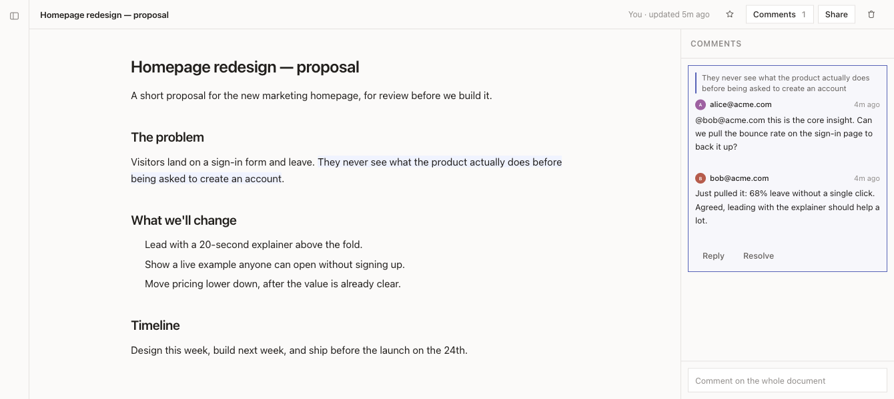

# Open Artifact

Your coding agent writes a report, a design doc, a dashboard. Right now that
lands as a file on your laptop that nobody else can see.

Open Artifact gives it a URL. The agent publishes, you get a link, you share it
with the people who need to read it. They comment on the exact paragraph they
are reacting to, and the agent reads those comments back and revises. You host
all of it yourself.

- **Publish from the agent.** One command, or the bundled skill so the agent
  does it without being asked.
- **HTML and Markdown.** HTML runs in a sandbox with no access to your session.
  Markdown is rendered with headings, tables and syntax highlighting.
- **Share deliberately.** Private by default. Open it to named people, to
  everyone at your email domain, or to anyone with the link.
- **Comment on a specific line.** Comments hold their position when the
  document is republished, and say so plainly when the text they pointed at is
  gone.
- **Feedback loop.** The agent reads the comments and publishes a new version.

## Use it free at open-artifact.com

Don't want to run a server? The hosted instance is live and free:
**[open-artifact.com](https://open-artifact.com)**. Sign up with your email,
connect your assistant, and start publishing — nothing to deploy. Everything
below this is for when you'd rather host your own.

[](https://open-artifact.com)

## Try it in two minutes

```bash
git clone https://github.com/iBala/open-artifact.git
cd open-artifact
pnpm install
pnpm --filter @open-artifact/server dev
```

Open http://localhost:3000. With no mail server configured, sign-in codes are
printed to the terminal, so you can sign in and click around without setting up
anything else.

## Run it for real

Everything you need is in `deploy/`.

```bash
cp deploy/env.example .env      # then fill in BASE_URL, SESSION_SECRET, SMTP
docker compose -f deploy/docker-compose.yml up -d
```

Two things to know before you go live:

**Put a reverse proxy in front of it.** The container binds to localhost only,
on purpose. Terminate TLS with Caddy, nginx or Traefik and forward to it.

**You need a mail server.** Sign-in codes and share notifications go out over
SMTP. Amazon SES, Postmark, Fastmail, your own — anything that speaks SMTP.
Without it, nobody can sign in.

Then prove the install works:

```bash
./deploy/smoke.sh https://artifacts.example.com
```

That signs in, publishes, checks the sandbox headers are really being sent,
shares, comments, republishes and confirms the comment kept its place. If it
passes, the instance is good.

### Who can sign up

`SIGNUP_MODE` decides. `invite-only` is the default: an account is created only
for someone an artifact was shared with. `domain-allowlist` opens it to listed
email domains. `open` lets anyone in. Every setting is explained in
`deploy/env.example`, and the server refuses to boot with a clear message if
something is missing or contradictory.

## Connect your agent

Two ways in, depending on whether the assistant has a terminal.

**Has a terminal** (Claude Code, Codex, Cursor, and friends) — hand your
assistant one sentence and let it set itself up:

> Set up Open Artifact for me. Install the CLI —
> `npm install -g open-artifact --registry https://registry.npmjs.org/` — then
> read `https://open-artifact.com/setup.md` and follow it.

Every instance serves its own `/setup.md`, so swap in your own address when you
self-host. That page walks the assistant through installing, signing you in, and
saving the skill. The skill itself lives in `skill/`.

**No terminal** (Claude on the web, ChatGPT) — the hosted MCP endpoint. Add
`https://artifacts.example.com/mcp` as a custom connector in the app's
settings; the instance walks the connector through OAuth and shows a consent
page. A connection can publish, update and share its own documents and read
their comments — and deliberately cannot delete anything, make anything
public, or read documents other people shared with you. `MCP_DESIGN.md` has
the reasoning. Header-capable tools can skip OAuth: mint a token under
Settings → Sessions → "Connect an assistant" and send it as
`Authorization: Bearer …`.

## How the pieces fit

| Folder | What it is |
| --- | --- |
| `packages/server` | Hono API, SQLite via Drizzle, auth, sharing, comments |
| `packages/web` | React and Vite front end |
| `packages/cli` | The `open-artifact` command the agent runs |
| `packages/shared` | Types and validation both sides use |
| `packages/e2e` | Playwright tests against a real browser |
| `skill/` | The agent instructions |
| `deploy/` | Compose file, environment template, smoke test |

The database is one SQLite file. Back that file up and you have backed up the
whole instance. The compose file includes a nightly backup that uses SQLite's
own `.backup` command, not a file copy, because copying a live database gives
you a corrupt one.

## Working on it

```bash
pnpm install
pnpm test          # unit and integration
pnpm lint
pnpm typecheck
pnpm --filter @open-artifact/e2e test    # browser tests
```

Tests come first here. If you are adding behaviour, the test that describes it
should exist before the code that satisfies it.

## Found a bug, or want something?

Open an issue on GitHub: **[github.com/iBala/open-artifact/issues](https://github.com/iBala/open-artifact/issues)**.
Bug reports, feature requests and rough ideas are all welcome — that's where we
track what to build next.

## Licence

Open Artifact is **fair-code**, under the [Sustainable Use License](LICENSE) —
the same licence n8n uses. You can self-host and modify it for free, including
inside a company. You cannot sell it or run it as a commercial hosted service
without a commercial licence. For that, or for an enterprise arrangement
(SSO/SAML, audit logs, dedicated hosting), email
[hello@open-artifact.com](mailto:hello@open-artifact.com).
